# AI-ARROW2024_Junior

## Навигация

- [AI-ARROW2024\_Junior](#ai-arrow2024_junior)
  - [Навигация](#навигация)
  - [A. Типы признаков](#a-типы-признаков)
  - [B. Задачи машинного обучения](#b-задачи-машинного-обучения)
  - [C. Аренда велосипедов (знакомство)](#c-аренда-велосипедов-знакомство)
  - [D. Чёрная пятница (знакомство)](#d-чёрная-пятница-знакомство)
  - [E. Слайсы в списках Python](#e-слайсы-в-списках-python)
  - [G. Прибыль фирмы](#g-прибыль-фирмы)
  - [F. Воскресные прогулки](#f-воскресные-прогулки)
  - [H. Тренировки](#h-тренировки)
  - [I. Визуализация тренировок](#i-визуализация-тренировок)
  - [J. Точка пересечения](#j-точка-пересечения)
  - [K. Типы шкал](#k-типы-шкал)
  - [L. Методы понижения размерности](#l-методы-понижения-размерности)
  - [M. Ирисы1](#m-ирисы1)
  - [N. Ирисы2](#n-ирисы2)
  - [O. Объем данных](#o-объем-данных)
  - [P. Пустые значения](#p-пустые-значения)
  - [Q. Средний балл по математике](#q-средний-балл-по-математике)
  - [R. Взвешиваем рыб](#r-взвешиваем-рыб)

## A. Типы признаков

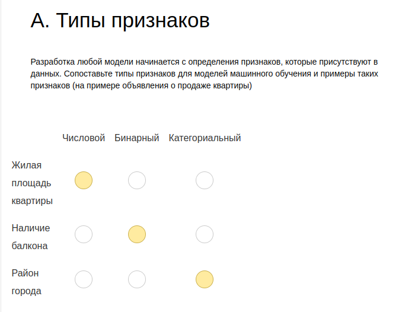

## B. Задачи машинного обучения

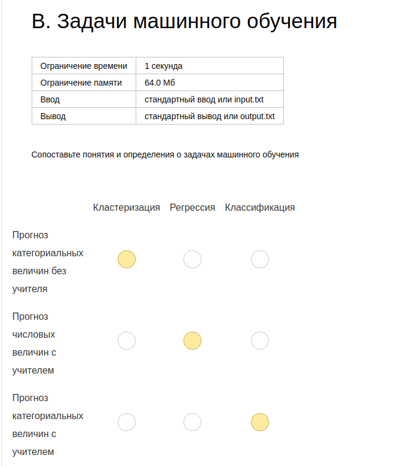

## C. Аренда велосипедов (знакомство)

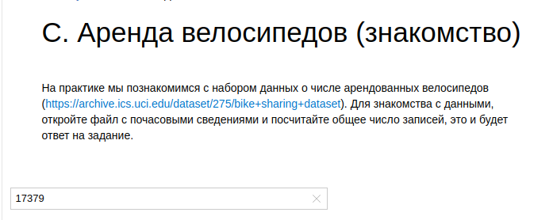

## D. Чёрная пятница (знакомство)

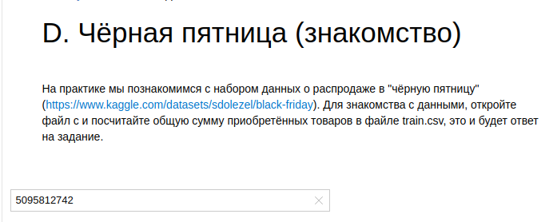

## E. Слайсы в списках Python

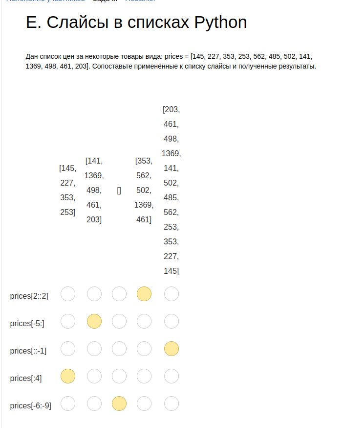

## [G. Прибыль фирмы](https://github.com/danula-ded/)

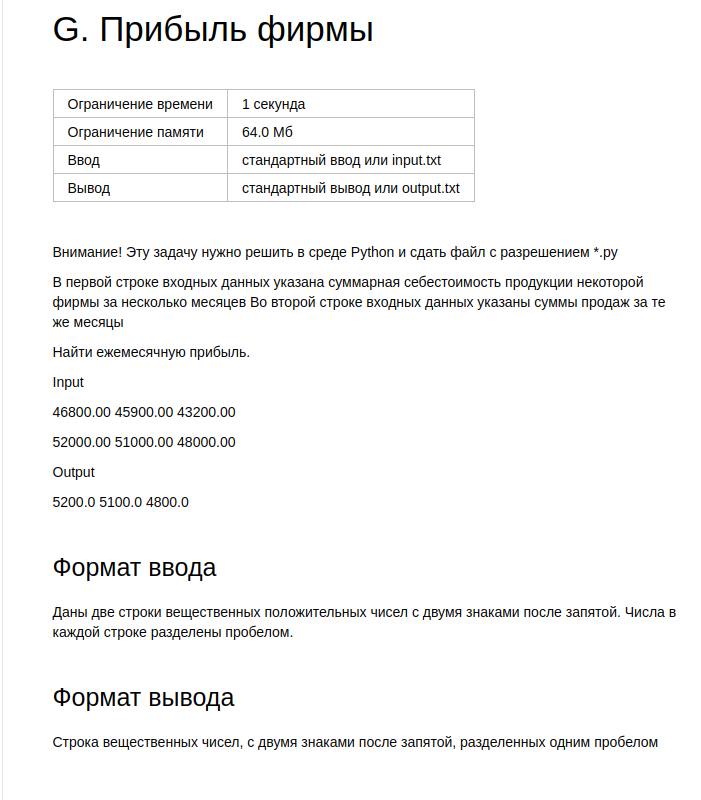

## [F. Воскресные прогулки](https://github.com/danula-ded/)

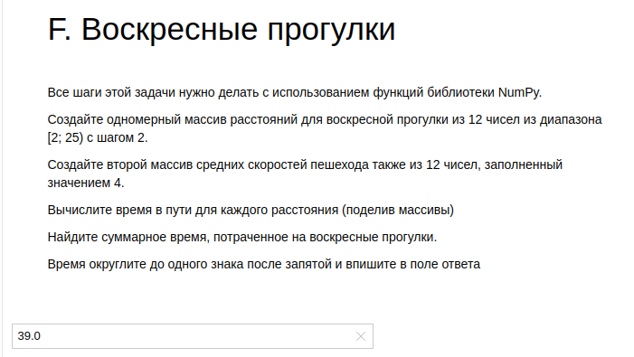

## [H. Тренировки](https://github.com/danula-ded/)

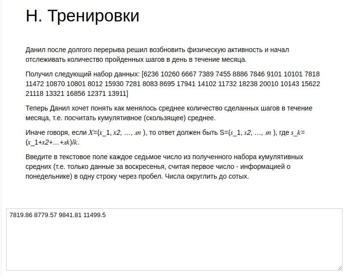

## [I. Визуализация тренировок](https://github.com/danula-ded/)

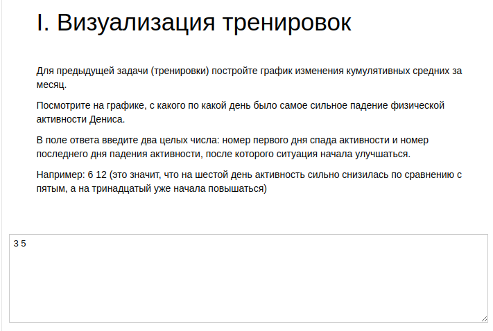

## [J. Точка пересечения](https://github.com/danula-ded/)

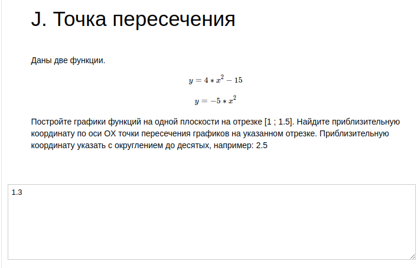

## K. Типы шкал

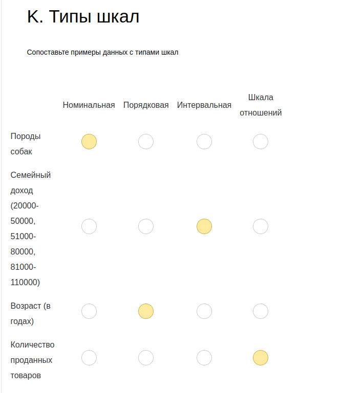

## L. Методы понижения размерности

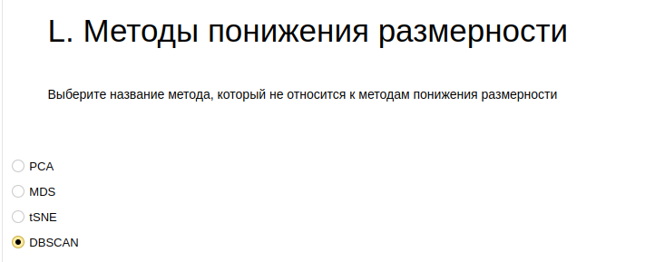

## [M. Ирисы1](https://github.com/danula-ded/)

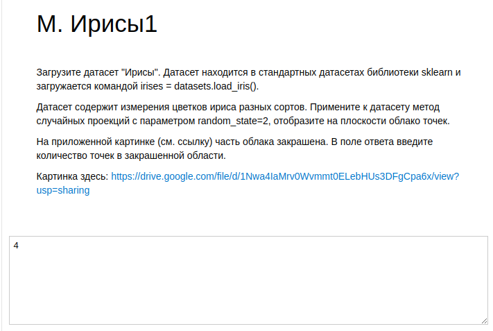

## [N. Ирисы2](https://github.com/danula-ded/)

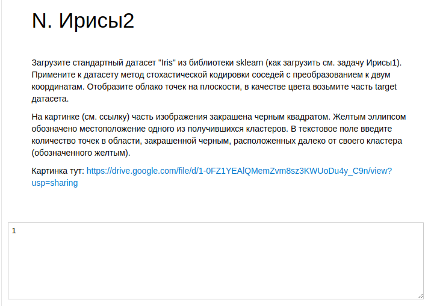

## [O. Объем данных](https://github.com/danula-ded/)

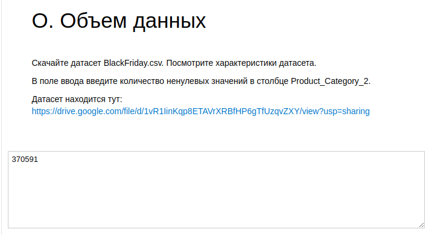

## [P. Пустые значения](https://github.com/danula-ded/)

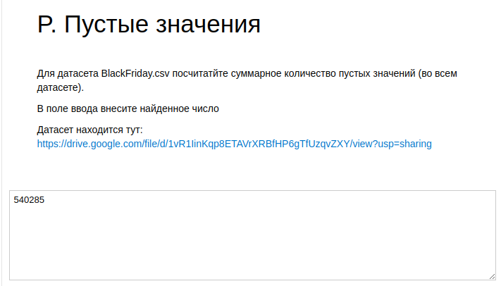

## [Q. Средний балл по математике](https://github.com/danula-ded/)

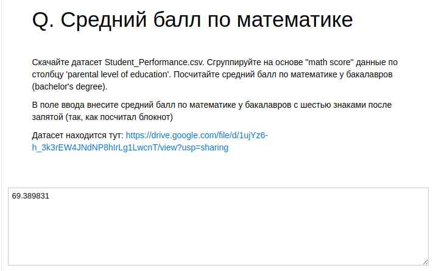

## [R. Взвешиваем рыб](https://github.com/danula-ded/)

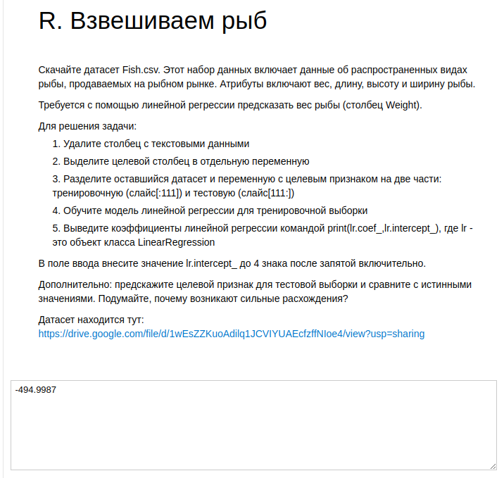